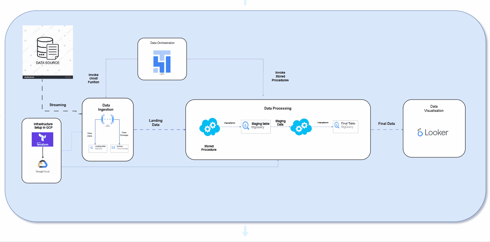

# ELT-Data-Pipeline 🚀

## A modern, modular data pipeline built on Google Cloud Platform (GCP) using Terraform, Cloud Functions, BigQuery, Airflow, and more!! ⚡

## 🧠 Overview

The pipeline is designed to:

- 🏗️ Create GCP infrastructure using Terraform
- ⚡ Ingest data from a public **data source** via **Cloud Functions**
- ⏱️ Schedule and orchestrate tasks using **Apache Airflow**
- 🔁 Run **stored procedures** in **BigQuery** to transform data
- 📊 Visualize the final output in **Looker dashboards**

---

## 📁 Project Structure

```bash
etl-data-pipeline/
├── terraform/              # Terraform scripts for GCP infra
├── cloud-function/         # Python code to ingest data
├── dags/                   # Airflow DAGs to orchestrate ETL
├── looker/                 # Looker configs or screenshots
├── images/                 # Diagrams or images
└── README.md
```

## 🛠️ System Architecture

